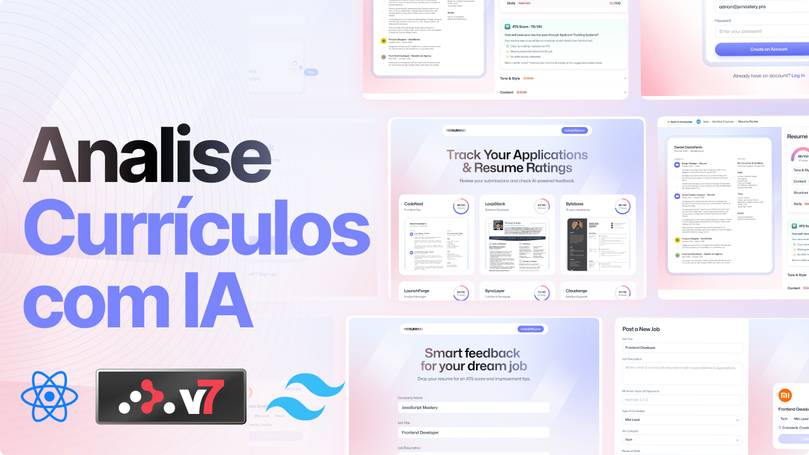

# 

## Descrição

Desenvolvi uma aplicação **React** escalável e serveless que utiliza **Inteligência Artificial Generativa** (LLMs) para analisar a compatibilidade de currículos com descrições de vagas, simulando algoritmos **ATS**. A arquitetura moderna em **TypeScript** integra serviços de nuvem complexo, incluindo autenticação, armazenamento e processamento de IA via Puter.js, diretamente no frontend, garantido uma interface responsiva e de alta performance construída com **Tailwind CSS** e gerenciamento de estado via **Zustand**.

## Impacto

Implementei um modelo de arquitetura de custo zero (user-pays) eliminando a necessidade de backend tradicional, enquanto entregava uma ferramenta que aumenta a taxa de sucesso de candidatos através de métricas de dados quantificáveis.
